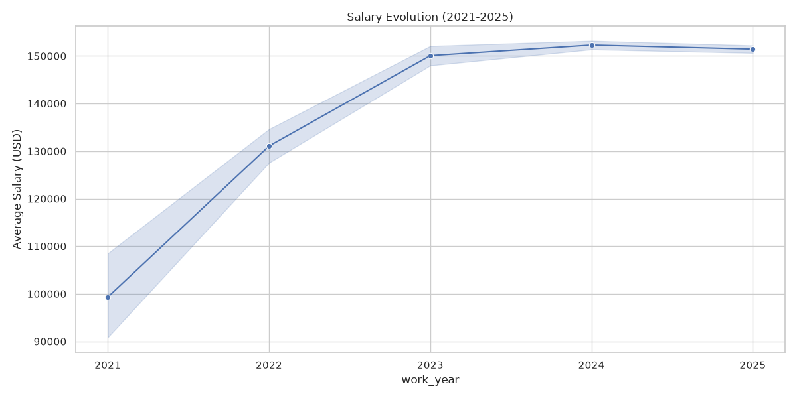
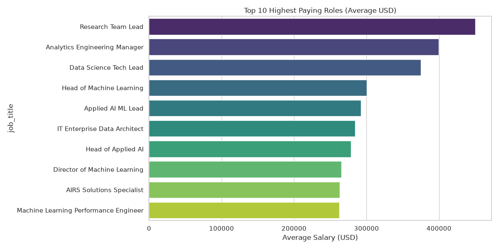
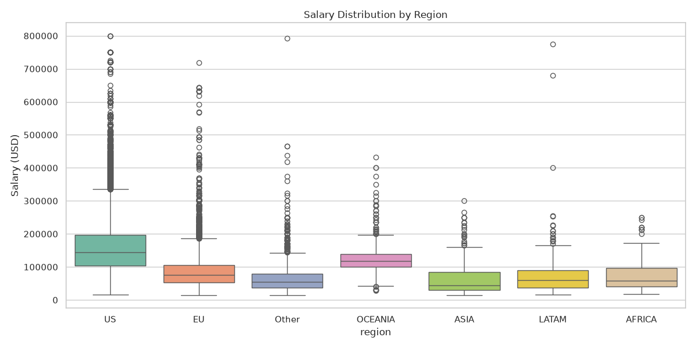
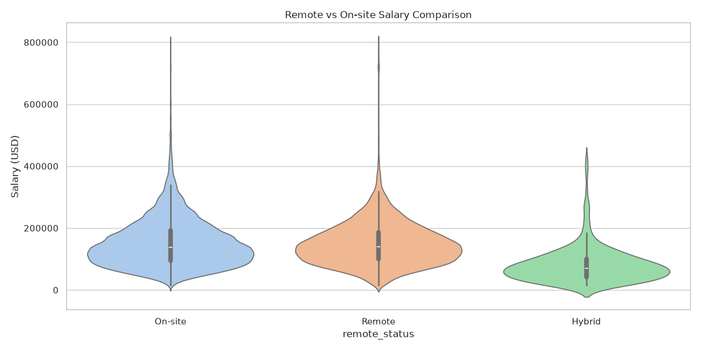

# 🚀 Tech Salaries Dashboard

[](https://www.python.org/)
[](https://pandas.pydata.org/)
[](https://streamlit.io/)
[](https://plotly.com/)
[](https://opensource.org/licenses/MIT)

An interactive dashboard to analyze global tech salaries, focusing on Data Science, AI, and Remote work trends from 2021 to 2025.

---

## 🔗 Live Demo
[View Dashboard on Streamlit Cloud](https://tech-salaries-dashboard-bushra-rawat.streamlit.app/) *(Placeholder)*

---

## 📊 Project Overview
This project provides a comprehensive analysis of the tech job market. It answers critical questions about geographic salary variations, the "remote premium," and how experience levels impact compensation in the modern tech landscape.

### Key Features
- **Global Insights:** Comparison between US, LATAM, EU, and ASIA.
- **Remote Work Analysis:** Salary trends for Remote vs. On-site vs. Hybrid roles.
- **Interactive Filters:** Filter by Year, Role, Region, and Experience Level.
- **KPI Tracking:** Real-time calculation of average salaries, remote percentage, and top regions.
- **Visual Analytics:** Interactive Plotly charts including Heatmaps, Boxplots, and Trend lines.

---

## 📸 Screenshots
| Salary Evolution | Top Roles |
|---|---|
|  |  |

| Regional Distribution | Remote vs On-site |
|---|---|
|  |  |

---

## 🛠️ Tech Stack
- **Data Processing:** Python, Pandas, Numpy
- **Visualizations:** Plotly Express, Matplotlib, Seaborn
- **Dashboard Framework:** Streamlit
- **Environment:** Jupyter Notebooks (for EDA)

---

## 🚀 Installation & Usage

### 1. Clone the repository
```bash
git clone https://github.com/rawbushra03/tech-salaries-dashboard.git
cd tech-salaries-dashboard
```

### 2. Set up Virtual Environment (Recommended)
```powershell
# Windows
python -m venv venv
.\venv\Scripts\activate
```

### 3. Install Dependencies
```bash
pip install -r requirements.txt
```

### 4. Run the Dashboard
```bash
streamlit run src/app.py
```

---

## 📁 Project Structure
```text
tech-salaries-dashboard/
├── README.md
├── requirements.txt
├── .gitignore
├── src/
│   ├── data_loader.py    # Data cleaning & standardization
│   ├── analyzer.py       # Statistical analysis & static plots
│   └── app.py            # Streamlit Dashboard
├── data/
│   ├── salaries_raw.csv      # Original dataset
│   └── salaries_cleaned.csv  # Processed dataset
├── notebooks/
│   └── exploratory_analysis.ipynb
└── screenshots/          # Exported visualizations
```

---

## 💡 Key Insights Discoveries
- **Remote Advantage:** Remote roles often command competitive salaries comparable to on-site roles in major tech hubs.
- **US Leadership:** The US remains the highest-paying market, but EU and LATAM are showing steady growth in remote opportunities.
- **Specialization Pays:** AI Engineers and Machine Learning Specialists are among the top earners globally.
- **Experience Matters:** There is a significant salary jump from Mid-level to Senior-level roles, emphasizing the value of specialized experience.

---

## 🤝 Contact
**Bushra Rawat**  
- [LinkedIn](https://www.linkedin.com/in/bushra-rawat/)  
- [GitHub](https://github.com/rawbushra03)  
- Email: rawatbush2003@gmail.com  

---
*License: MIT*
